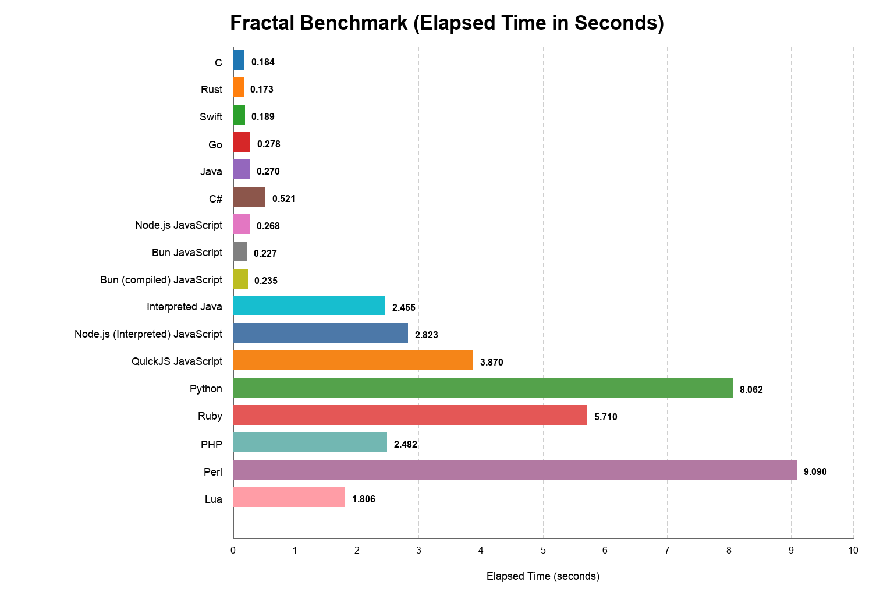
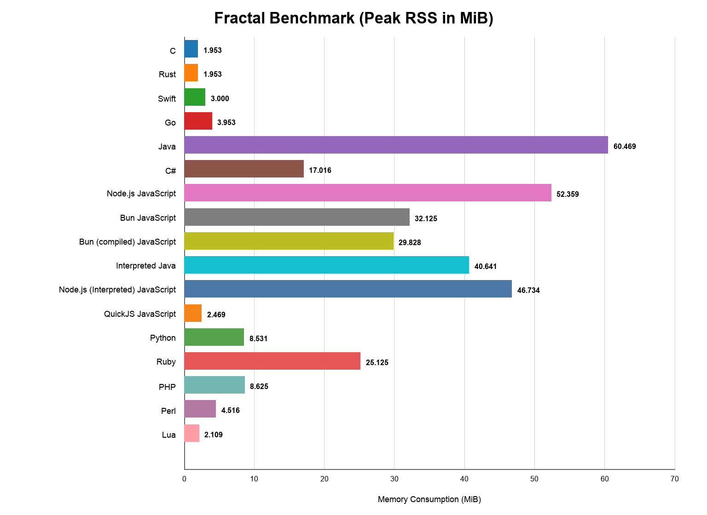

Fractal Benchmark
=================

## What this benchmark does

This benchmark renders an ASCII Mandelbrot set repeatedly. For each
iteration it walks a fixed 78 by 78 grid of complex-plane sample points,
computes the Mandelbrot escape iteration count for each point, and
writes either `*` or a space depending on whether the point stays in the
set.

The benchmark therefore mainly measures floating-point arithmetic,
tightly nested loops, branch-heavy escape checks, and repeated text
output while keeping the rendered image identical across languages.

## Benchmark system

- Apple M1 Pro (`arm64`)
- 10 CPU cores

Use `./run.sh` for benchmark-only timings reported by each implementation. Use `./timed_run.sh` to pre-build compiled implementations and then measure only the benchmark command with `/usr/bin/time`; on supported platforms it also reports peak RSS.

## Results

| Language | Time (s) | Total Time (s) | Start Time (s) | Max RSS (MiB) |
| --- | ---: | ---: | ---: | ---: |
| C | 0.184 | 0.30 | 0.000 | 1.953 |
| Rust | 0.173 | 0.33 | 0.000 | 1.953 |
| Swift | 0.189 | 0.34 | 0.000 | 3.000 |
| Go | 0.278 | 0.43 | 0.000 | 3.953 |
| Java | 0.270 | 0.33 | 0.000 | 60.469 |
| C# | 0.521 | 0.52 | 0.000 | 17.016 |
| Node.js JavaScript | 0.268 | 0.29 | 0.000 | 52.359 |
| Bun JavaScript | 0.227 | 0.23 | 0.000 | 32.125 |
| Bun (compiled) JavaScript | 0.235 | 0.80 | 0.000 | 29.828 |
| Interpreted Java | 2.455 | 2.49 | 0.000 | 40.641 |
| Node.js (Interpreted) JavaScript | 2.823 | 2.86 | 0.000 | 46.734 |
| QuickJS JavaScript | 3.870 | 3.85 | 0.000 | 2.469 |
| Python | 8.062 | 8.09 | 0.000 | 8.531 |
| Ruby | 5.710 | 5.77 | 0.000 | 25.125 |
| PHP | 2.482 | 2.50 | 0.000 | 8.625 |
| Perl | 9.090 | 9.01 | 0.000 | 4.516 |
| Lua | 1.806 | 1.80 | 0.000 | 2.109 |

