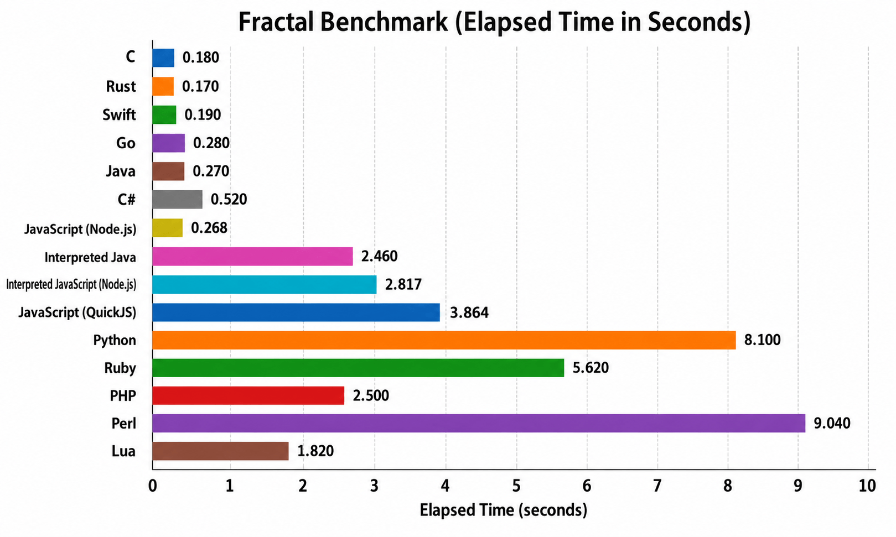

Fractal Benchmark
=================

## What this benchmark does

This benchmark renders an ASCII Mandelbrot set repeatedly. For each
iteration it walks a fixed 78 by 78 grid of complex-plane sample points,
computes the Mandelbrot escape iteration count for each point, and
writes either `*` or a space depending on whether the point stays in the
set.

The benchmark therefore mainly measures floating-point arithmetic,
tightly nested loops, branch-heavy escape checks, and repeated text
output while keeping the rendered image identical across languages.

## Benchmark system

- Apple M1 Pro (`arm64`)
- 10 CPU cores

## Results

| Language | Time (s) |
| --- | ---: |
| C | 0.180 |
| Rust | 0.170 |
| Swift | 0.190 |
| Go | 0.280 |
| Java | 0.270 |
| C# | 0.520 |
| JavaScript (Node.js) | 0.268 |
| Interpreted Java | 2.460 |
| Interpreted JavaScript (Node.js) | 2.817 |
| JavaScript (QuickJS) | 3.864 |
| Python | 8.100 |
| Ruby | 5.620 |
| PHP | 2.500 |
| Perl | 9.040 |
| Lua | 1.820 |

