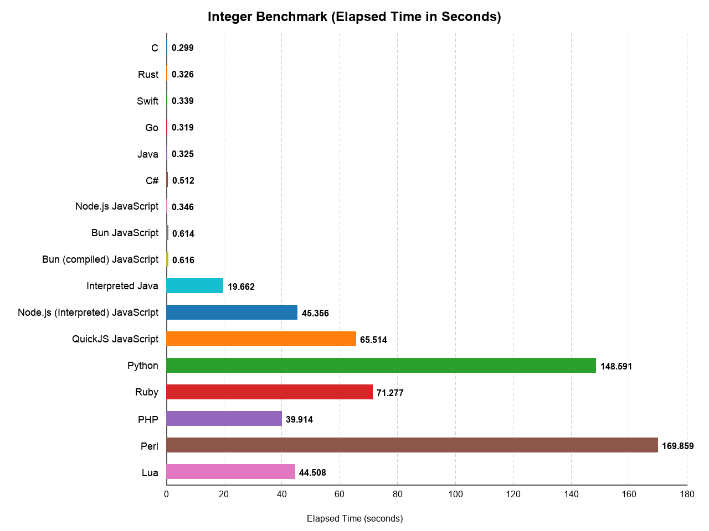
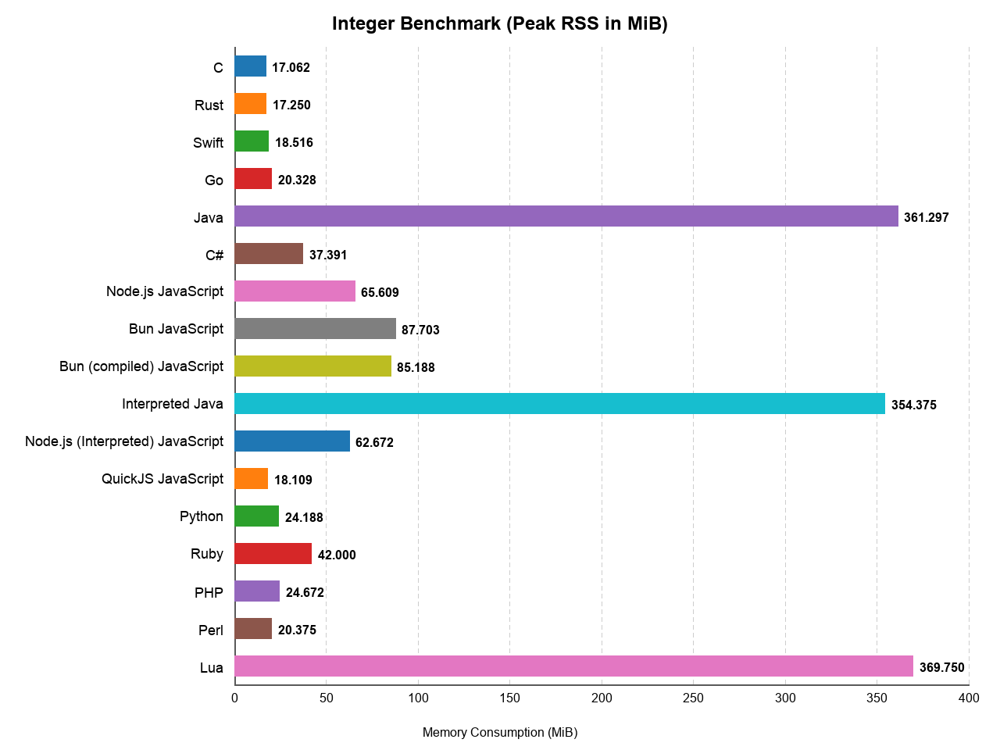

Integer Benchmark
=================

## What this benchmark does

This benchmark repeatedly computes SHA-256 digests for a fixed input in
pure language-level code and verifies the final result stays correct.
SHA-256 was chosen here because it is heavy on integer arithmetic,
bitwise operations, rotations, and tightly repeated state updates.

The point of this benchmark is therefore not "how fast can language X do
real-world SHA-256". In practice, nobody would hand-write SHA-256 in
Python, Ruby, or JavaScript for production use. Real applications would
call optimized library code that runs mostly at native speed. This
benchmark is instead meant as a cross-language test of integer-heavy
computation in ordinary userland code.

## Benchmark system

- Apple M1 Pro (`arm64`)
- 10 CPU cores

Use `./run.sh` for benchmark-only timings reported by each
implementation. Use `./timed_run.sh` to pre-build compiled
implementations and then measure only the benchmark command with
`/usr/bin/time`; on supported platforms it also reports peak RSS.

## Results

| Language | Time (s) | Total Time (s) | Start Time (s) | Max RSS (MiB) |
| --- | ---: | ---: | ---: | ---: |
| C | 0.299 | 0.67 | 0.000 | 17.062 |
| Rust | 0.326 | 0.62 | 0.000 | 17.250 |
| Swift | 0.339 | 0.62 | 0.000 | 18.516 |
| Go | 0.319 | 0.67 | 0.000 | 20.328 |
| Java | 0.325 | 0.57 | 0.000 | 361.297 |
| C# | 0.512 | 0.74 | 0.000 | 37.391 |
| Node.js JavaScript | 0.346 | 1.06 | 0.000 | 65.609 |
| Bun JavaScript | 0.614 | 1.75 | 0.000 | 87.703 |
| Bun (compiled) JavaScript | 0.616 | 2.31 | 0.000 | 85.188 |
| Interpreted Java | 19.662 | 26.10 | 0.000 | 354.375 |
| Node.js (Interpreted) JavaScript | 45.356 | 60.82 | 0.000 | 62.672 |
| QuickJS JavaScript | 65.514 | 90.31 | 0.000 | 18.109 |
| Python | 148.591 | 194.91 | 0.000 | 24.188 |
| Ruby | 71.277 | 96.44 | 0.000 | 42.000 |
| PHP | 39.914 | 54.32 | 0.000 | 24.672 |
| Perl | 169.859 | 221.19 | 0.000 | 20.375 |
| Lua | 44.508 | 57.41 | 0.000 | 369.750 |

