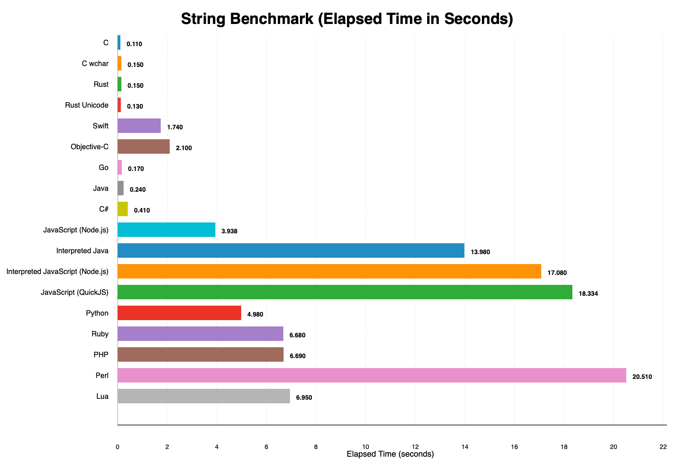
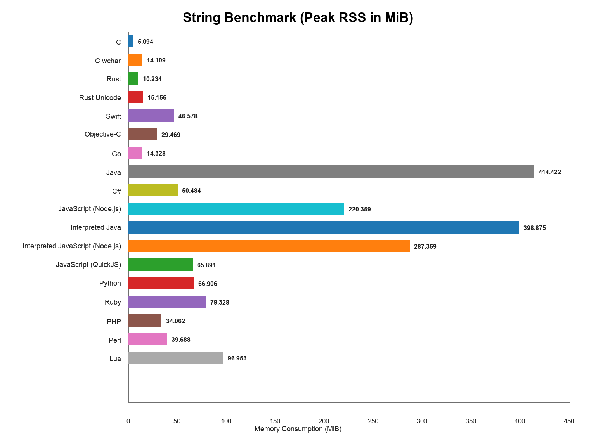

String Benchmark
================

## What this benchmark does

This benchmark generates a deterministic source text of a bit more than 1 MiB by concatenating pseudo-randomly selected UTF-8 or UTF-16 words from a fixed word list. It then measures how fast each implementation can:

- split the source text into words,
- re-wrap those words into lines below 80 characters, and
- hash the resulting wrapped text to verify the output stays correct.

The workload is repeated for the configured iteration count. The
benchmark therefore mainly measures string splitting, concatenation,
line-wrapping logic, and result verification on a large in-memory text.

## String-specific variants

- **C (UTF-16):** Alternative C implementation using fixed-width UTF-16 code units instead of UTF-8 bytes.
- **Rust (UTF-16):** Alternative Rust implementation working on UTF-16 code units rather than byte-oriented string handling.

## Benchmark system

- Apple M1 Pro (`arm64`)
- 10 CPU cores

Use `./run.sh` for benchmark-only timings reported by each implementation. Use `./timed_run.sh` to pre-build compiled implementations and then measure only the benchmark command with `/usr/bin/time`; on supported platforms it also reports peak RSS.

## Results

| Language | Time (s) | Total Time (s) | Start Time (s) | Max RSS (MiB) |
| --- | ---: | ---: | ---: | ---: |
| C | 0.250 | 0.25 | 0.000 | 5.094 |
| C UTF-16 | 0.290 | 0.29 | 0.000 | 14.109 |
| Rust | 0.300 | 0.30 | 0.000 | 10.234 |
| Rust UTF-16 | 0.280 | 0.28 | 0.000 | 15.156 |
| Swift | 1.900 | 1.90 | 0.000 | 46.578 |
| Objective-C | 2.160 | 2.16 | 0.000 | 29.469 |
| Go | 0.340 | 0.34 | 0.000 | 14.328 |
| Java | 0.300 | 0.30 | 0.000 | 414.422 |
| C# | 0.430 | 0.43 | 0.000 | 50.484 |
| JavaScript (Node.js) | 4.060 | 4.06 | 0.000 | 220.359 |
| Interpreted Java | 14.260 | 14.26 | 0.000 | 398.875 |
| Interpreted JavaScript (Node.js) | 17.350 | 17.35 | 0.000 | 287.359 |
| JavaScript (QuickJS) | 18.740 | 18.74 | 0.000 | 65.891 |
| Python | 5.410 | 5.41 | 0.000 | 66.906 |
| Ruby | 7.080 | 7.08 | 0.000 | 79.328 |
| PHP | 6.870 | 6.87 | 0.000 | 34.062 |
| Perl | 21.080 | 21.08 | 0.000 | 39.688 |
| Lua | 7.050 | 7.05 | 0.000 | 96.953 |

