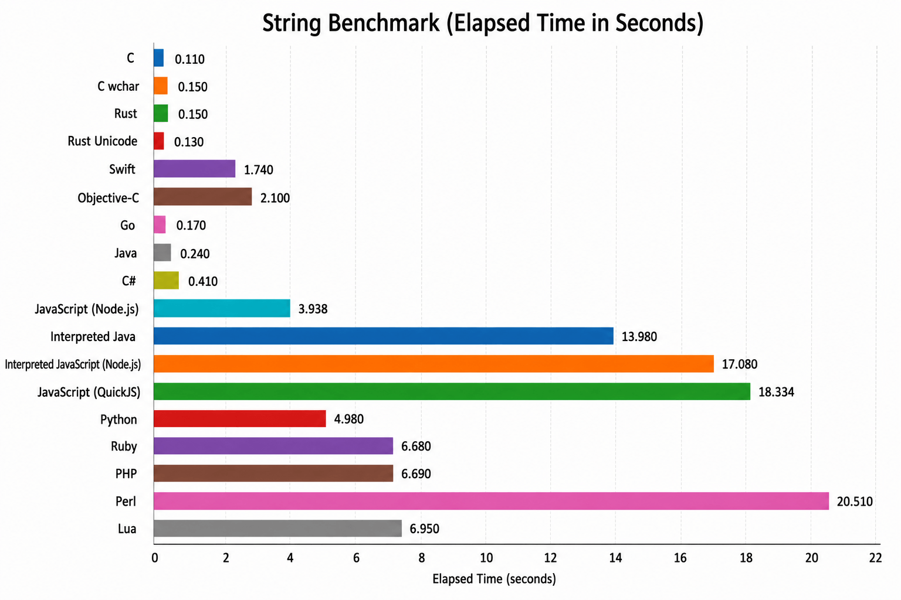

String Benchmark
================

## What this benchmark does

This benchmark generates a deterministic source text of a bit more than
1 MiB by concatenating pseudo-randomly selected ASCII words from a fixed
word list. It then measures how fast each implementation can:

- split the source text into words,
- re-wrap those words into lines below 80 characters, and
- hash the resulting wrapped text to verify the output stays correct.

The workload is repeated for the configured iteration count. The
benchmark therefore mainly measures string splitting, concatenation,
line-wrapping logic, and result verification on a large in-memory text.

## String-specific variants

- **C (`wchar_t`):** Alternative C implementation using wide characters
  instead of narrow ASCII-oriented strings.
- **Rust (Unicode scalar values):** Alternative Rust implementation
  working on Unicode scalar values rather than byte-oriented string
  handling.

## Benchmark system

- Apple M1 Pro (`arm64`)
- 10 CPU cores

## Results

| Language | Time (s) |
| --- | ---: |
| C | 0.110 |
| C wchar | 0.150 |
| Rust | 0.150 |
| Rust Unicode | 0.130 |
| Swift | 1.740 |
| Objective-C | 2.100 |
| Go | 0.170 |
| Java | 0.240 |
| C# | 0.410 |
| JavaScript (Node.js) | 3.938 |
| Interpreted Java | 13.980 |
| Interpreted JavaScript (Node.js) | 17.080 |
| JavaScript (QuickJS) | 18.334 |
| Python | 4.980 |
| Ruby | 6.680 |
| PHP | 6.690 |
| Perl | 20.510 |
| Lua | 6.950 |

