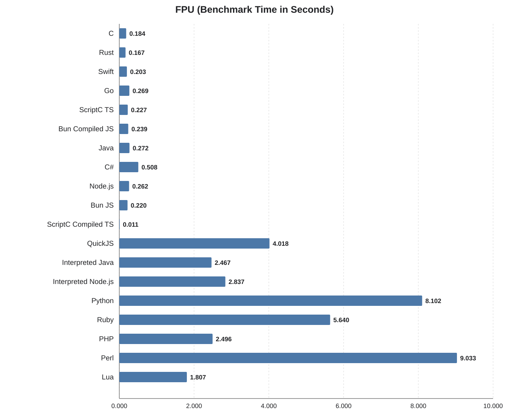
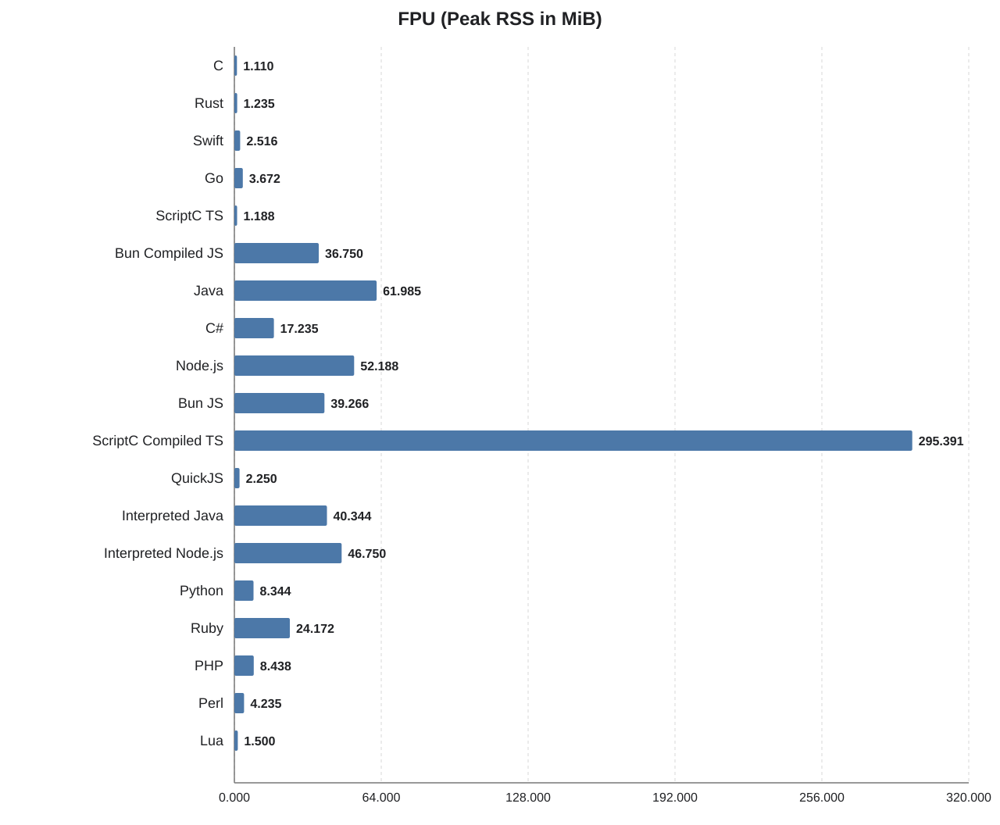
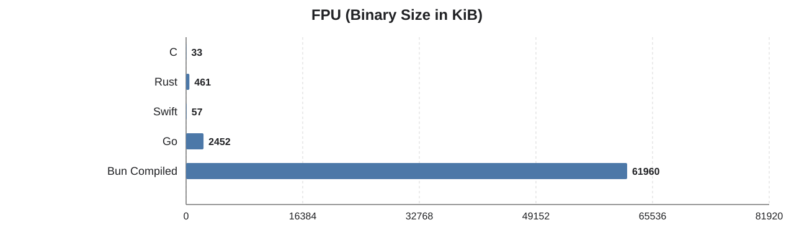

FPU
===

## What this benchmark does

This benchmark renders an ASCII Mandelbrot set repeatedly. For each
iteration it walks a fixed 78 by 78 grid of complex-plane sample points,
computes the Mandelbrot escape iteration count for each point, and
writes either `*` or a space depending on whether the point stays in the
set.

The benchmark therefore mainly measures floating-point arithmetic,
tightly nested loops, branch-heavy escape checks, and repeated text
output while keeping the rendered image identical across languages.

## Benchmark system

- Apple M1 Pro (`arm64`)
- 10 CPU cores

Use `../../run -b fpu` to measure this benchmark. It pre-builds compiled
implementations and measures each benchmark command with `/usr/bin/time`.

## Results

| Language | Total (s) | Benchmark (s) | Binary (KiB) | Memory (MiB) |
| --- | ---: | ---: | ---: | ---: |
| C | 0.410 | 0.185 | 33 | 1.172 |
| Rust | 0.310 | 0.172 | 461 | 1.235 |
| Swift | 0.350 | 0.205 | 57 | 2.485 |
| Go | 0.420 | 0.266 | 2452 | 3.782 |
| ScriptC Compiled TS | 0.370 | 0.228 | 390 | 1.219 |
| Bun Compiled JS | 0.820 | 0.229 | 61960 | 36.750 |
| Java | 0.320 | 0.271 | n/a | 61.579 |
| C# | 0.520 | 0.506 | n/a | 17.204 |
| Node.js | 0.290 | 0.262 | n/a | 52.610 |
| Bun JS | 0.230 | 0.220 | n/a | 40.063 |
| ScriptC TS | 1.420 | 0.011 | n/a | 347.094 |
| Interpreted Java | 2.510 | 2.464 | n/a | 40.375 |
| Interpreted Node.js | 2.860 | 2.828 | n/a | 46.750 |
| QuickJS | 3.960 | 3.956 | n/a | 2.219 |
| Python | 8.170 | 8.140 | n/a | 8.516 |
| Ruby | 5.700 | 5.640 | n/a | 24.500 |
| PHP | 2.500 | 2.491 | n/a | 8.282 |
| Perl | 9.060 | 9.049 | n/a | 4.063 |
| Lua | 1.800 | 1.796 | n/a | 1.500 |

