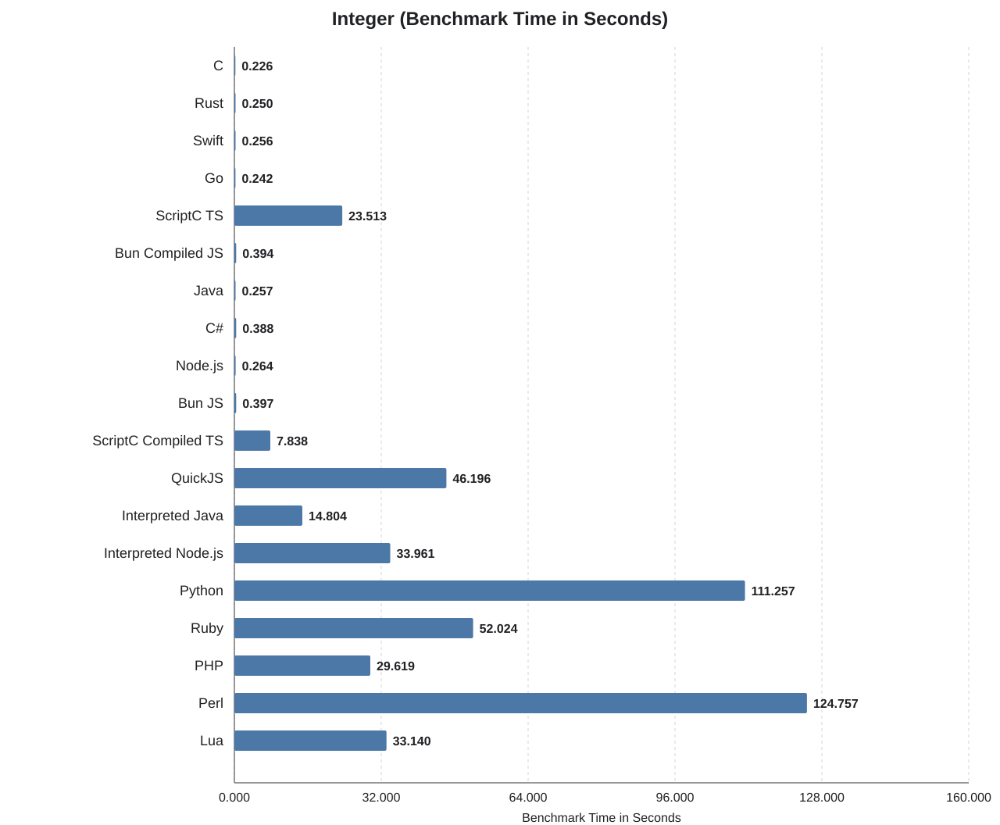
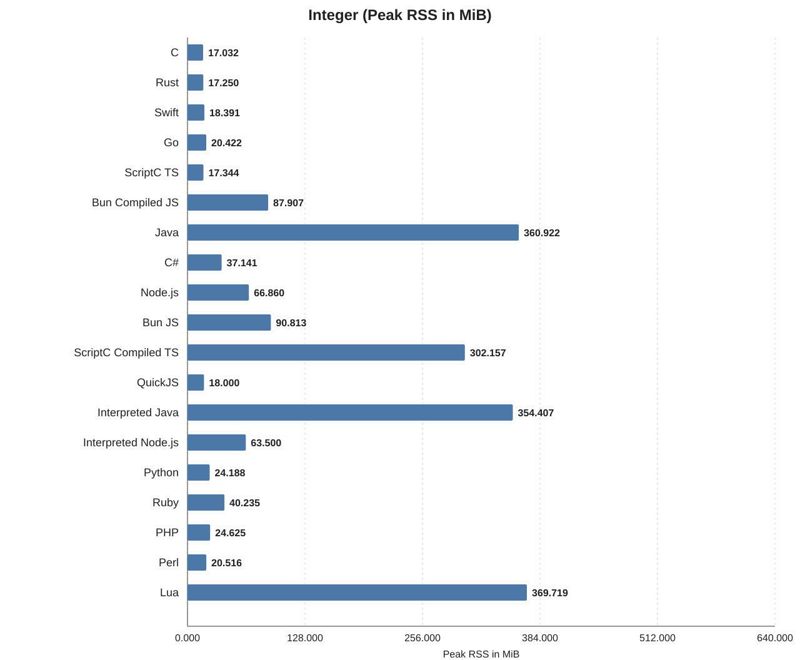
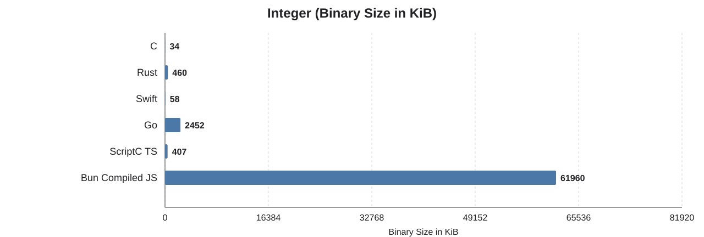

Integer
=======

## What this benchmark does

This benchmark repeatedly computes SHA-256 digests for a fixed input in
pure language-level code and verifies the final result stays correct.
SHA-256 was chosen here because it is heavy on integer arithmetic,
bitwise operations, rotations, and tightly repeated state updates.

The point of this benchmark is therefore not "how fast can language X do
real-world SHA-256". In practice, nobody would hand-write SHA-256 in
Python, Ruby, or JavaScript for production use. Real applications would
call optimized library code that runs mostly at native speed. This
benchmark is instead meant as a cross-language test of integer-heavy
computation in ordinary userland code.

## Benchmark system

- Apple M1 Pro (`arm64`)
- 10 CPU cores

Use `../../run -b integer` to measure this benchmark. It pre-builds compiled
implementations and measures each benchmark command with `/usr/bin/time`.

## Results

| Language | Total (s) | Benchmark (s) | Binary (KiB) | Memory (MiB) |
| --- | ---: | ---: | ---: | ---: |
| C | 0.580 | 0.226 | 34 | 17.032 |
| Rust | 0.510 | 0.250 | 460 | 17.250 |
| Swift | 0.520 | 0.256 | 58 | 18.391 |
| Go | 0.550 | 0.242 | 2452 | 20.422 |
| ScriptC TS | 33.810 | 23.513 | 407 | 17.344 |
| Bun Compiled JS | 1.910 | 0.394 | 61960 | 87.907 |
| Java | 0.460 | 0.257 | n/a | 360.922 |
| C# | 0.580 | 0.388 | n/a | 37.141 |
| Node.js | 0.960 | 0.264 | n/a | 66.860 |
| Bun JS | 1.320 | 0.397 | n/a | 90.813 |
| ScriptC Compiled TS | 19.710 | 7.838 | n/a | 302.157 |
| QuickJS | 65.180 | 46.196 | n/a | 18.000 |
| Interpreted Java | 20.740 | 14.804 | n/a | 354.407 |
| Interpreted Node.js | 47.890 | 33.961 | n/a | 63.500 |
| Python | 152.510 | 111.257 | n/a | 24.188 |
| Ruby | 73.620 | 52.024 | n/a | 40.235 |
| PHP | 42.900 | 29.619 | n/a | 24.625 |
| Perl | 177.300 | 124.757 | n/a | 20.516 |
| Lua | 47.920 | 33.140 | n/a | 369.719 |

