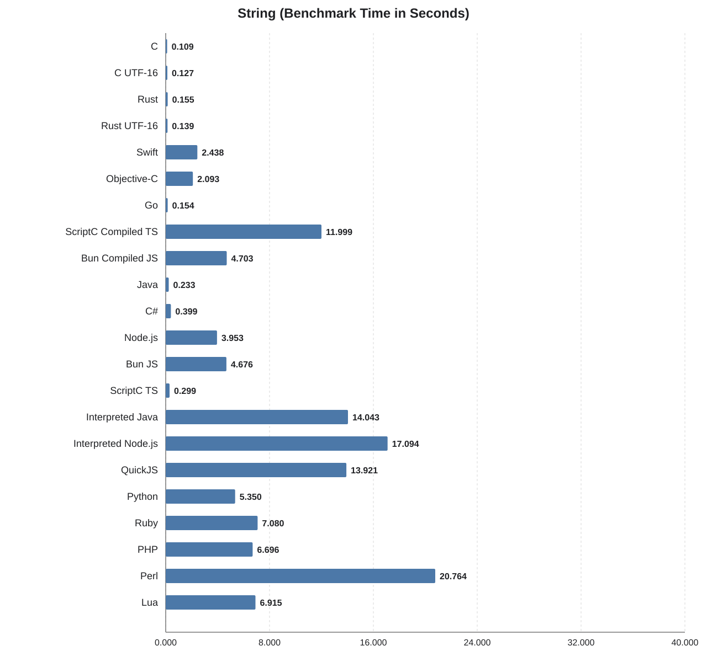
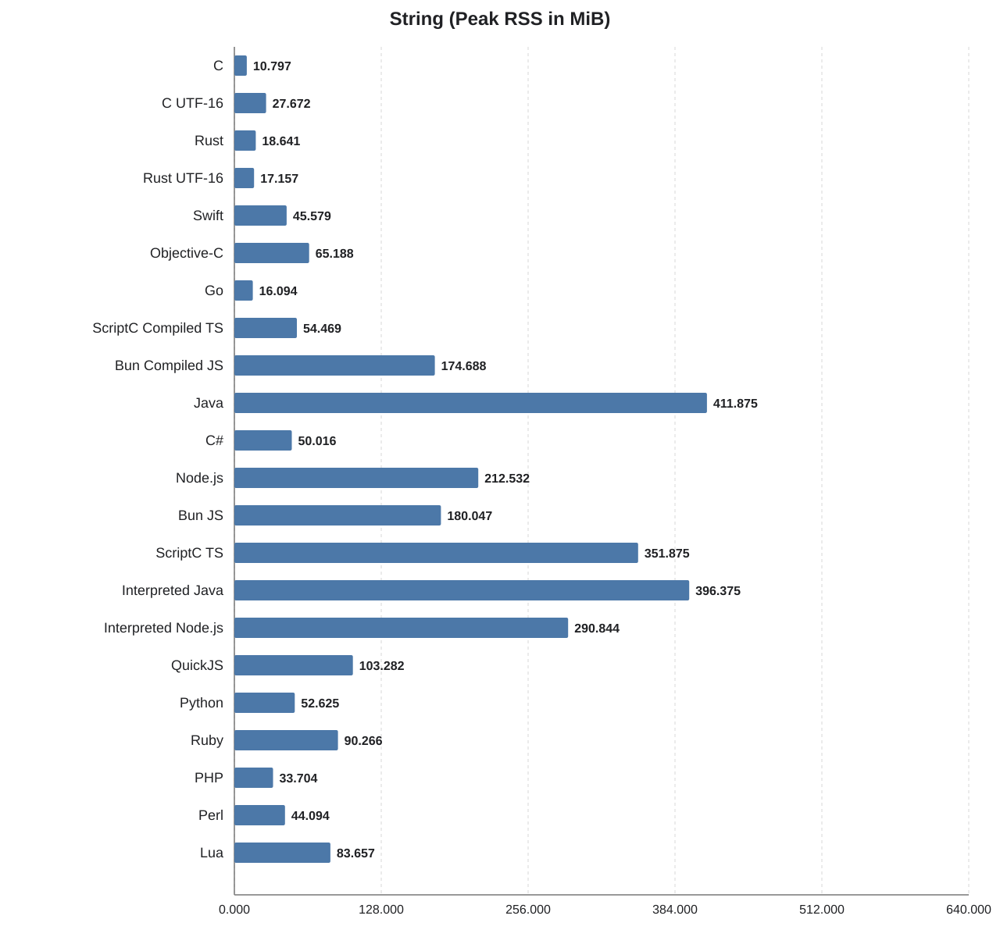
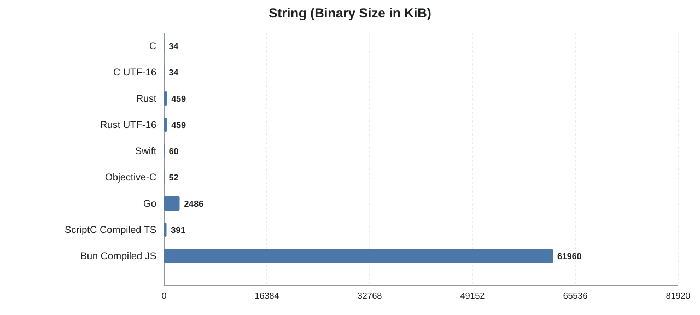

String
======

## What this benchmark does

This benchmark generates a deterministic source text of a bit more than 1 MiB by concatenating pseudo-randomly selected UTF-8 or UTF-16 words from a fixed word list. It then measures how fast each implementation can:

- split the source text into words,
- re-wrap those words into lines below 80 characters, and
- hash the resulting wrapped text to verify the output stays correct.

The workload is repeated for the configured iteration count. The
benchmark therefore mainly measures string splitting, concatenation,
line-wrapping logic, and result verification on a large in-memory text.

## String-specific variants

- **C (UTF-16):** Alternative C implementation using fixed-width UTF-16 code units instead of UTF-8 bytes.
- **Rust (UTF-16):** Alternative Rust implementation working on UTF-16 code units rather than byte-oriented string handling.

## Benchmark system

- Apple M1 Pro (`arm64`)
- 10 CPU cores

Use `../../run -b string` to measure this benchmark. It pre-builds compiled
implementations and measures each benchmark command with `/usr/bin/time`.

## Results

| Language | Total (s) | Benchmark (s) | Binary (KiB) | Memory (MiB) |
| --- | ---: | ---: | ---: | ---: |
| C | 0.250 | 0.109 | 34 | 10.797 |
| C UTF-16 | 0.270 | 0.127 | 34 | 27.672 |
| Rust | 0.290 | 0.155 | 459 | 18.641 |
| Rust UTF-16 | 0.280 | 0.139 | 459 | 17.157 |
| Swift | 2.580 | 2.438 | 60 | 45.579 |
| Objective-C | 2.270 | 2.093 | 52 | 65.188 |
| Go | 0.320 | 0.154 | 2486 | 16.094 |
| ScriptC Compiled TS | 12.310 | 11.999 | 391 | 54.469 |
| Bun Compiled JS | 5.410 | 4.703 | 61960 | 174.688 |
| Java | 0.300 | 0.233 | n/a | 411.875 |
| C# | 0.420 | 0.399 | n/a | 50.016 |
| Node.js | 4.060 | 3.953 | n/a | 212.532 |
| Bun JS | 4.980 | 4.676 | n/a | 180.047 |
| ScriptC TS | 1.960 | 0.299 | n/a | 351.875 |
| Interpreted Java | 14.320 | 14.043 | n/a | 396.375 |
| Interpreted Node.js | 17.360 | 17.094 | n/a | 290.844 |
| QuickJS | 14.270 | 13.921 | n/a | 103.282 |
| Python | 5.530 | 5.350 | n/a | 52.625 |
| Ruby | 7.300 | 7.080 | n/a | 90.266 |
| PHP | 6.870 | 6.696 | n/a | 33.704 |
| Perl | 21.290 | 20.764 | n/a | 44.094 |
| Lua | 7.090 | 6.915 | n/a | 83.657 |

