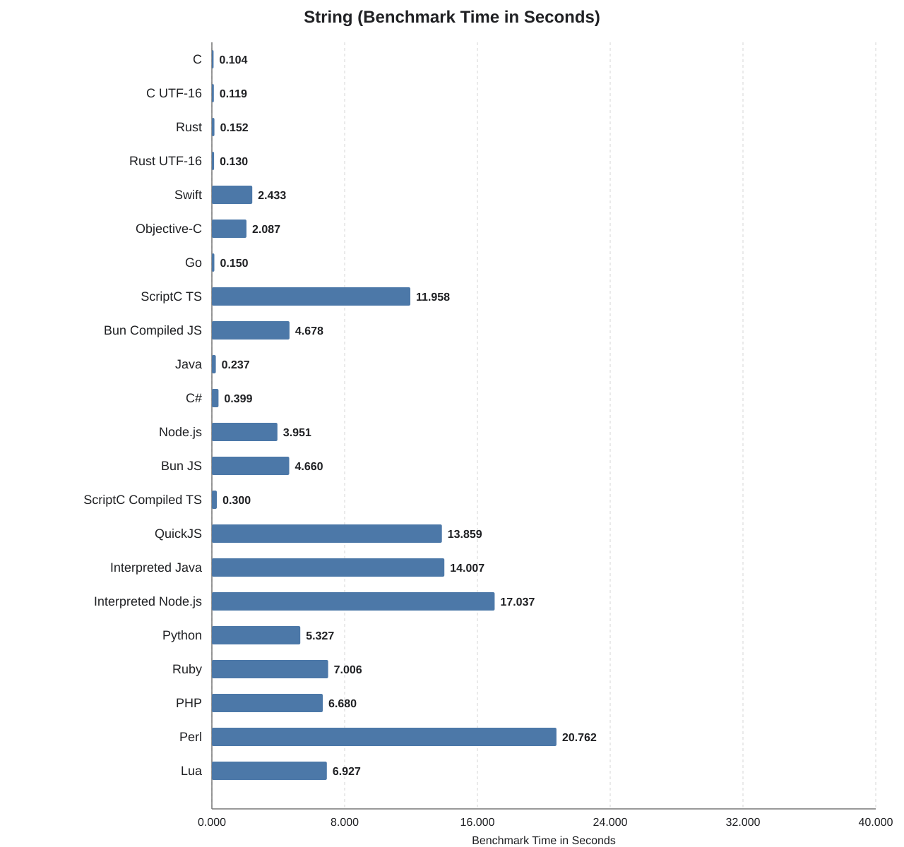
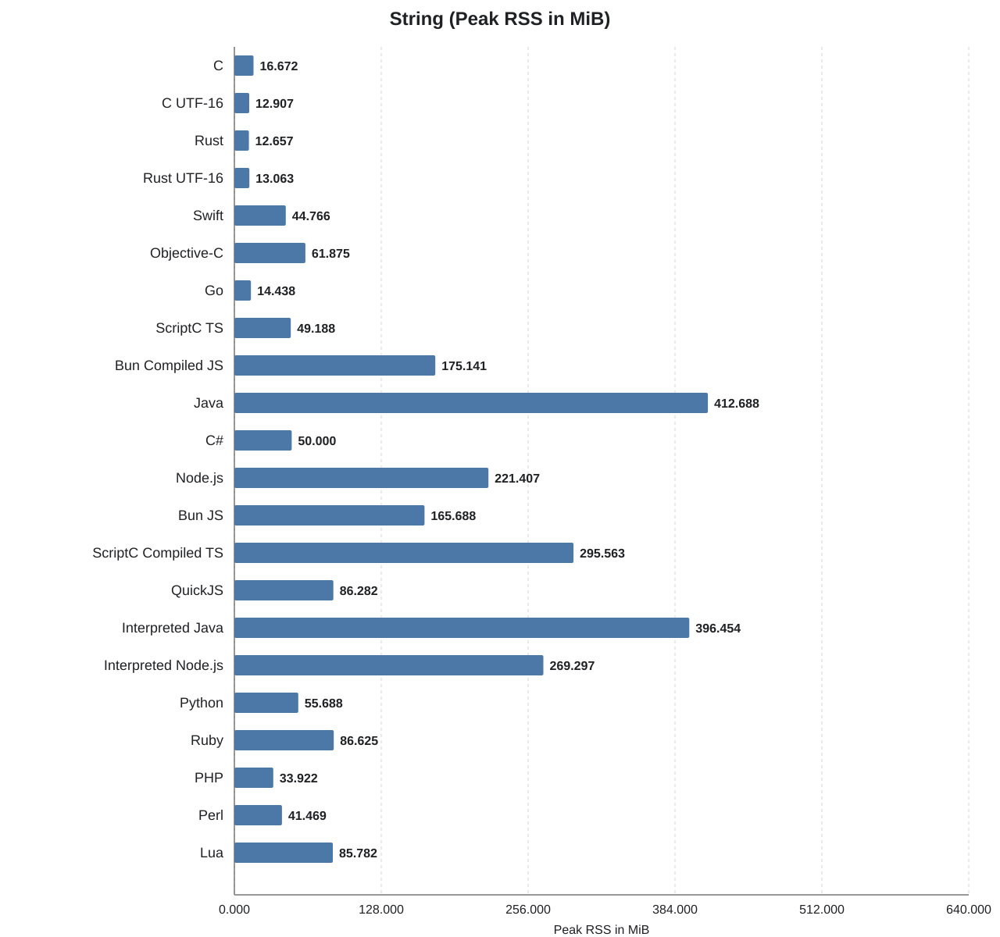
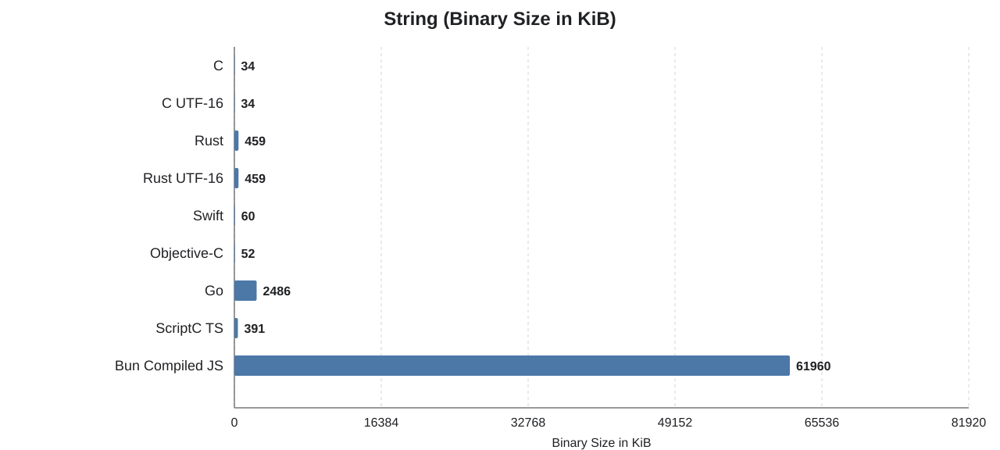

String
======

## What this benchmark does

This benchmark generates a deterministic source text of a bit more than 1 MiB by concatenating pseudo-randomly selected UTF-8 or UTF-16 words from a fixed word list. It then measures how fast each implementation can:

- split the source text into words,
- re-wrap those words into lines below 80 characters, and
- hash the resulting wrapped text to verify the output stays correct.

The workload is repeated for the configured iteration count. The
benchmark therefore mainly measures string splitting, concatenation,
line-wrapping logic, and result verification on a large in-memory text.

## String-specific variants

- **C (UTF-16):** Alternative C implementation using fixed-width UTF-16 code units instead of UTF-8 bytes.
- **Rust (UTF-16):** Alternative Rust implementation working on UTF-16 code units rather than byte-oriented string handling.

## Benchmark system

- Apple M1 Pro (`arm64`)
- 10 CPU cores

Use `../../run -b string` to measure this benchmark. It pre-builds compiled
implementations and measures each benchmark command with `/usr/bin/time`.

## Results

| Language | Total (s) | Benchmark (s) | Binary (KiB) | Memory (MiB) |
| --- | ---: | ---: | ---: | ---: |
| C | 0.330 | 0.104 | 34 | 16.672 |
| C UTF-16 | 0.260 | 0.119 | 34 | 12.907 |
| Rust | 0.300 | 0.152 | 459 | 12.657 |
| Rust UTF-16 | 0.280 | 0.130 | 459 | 13.063 |
| Swift | 2.580 | 2.433 | 60 | 44.766 |
| Objective-C | 2.250 | 2.087 | 52 | 61.875 |
| Go | 0.310 | 0.150 | 2486 | 14.438 |
| ScriptC TS | 12.270 | 11.958 | 391 | 49.188 |
| Bun Compiled JS | 5.370 | 4.678 | 61960 | 175.141 |
| Java | 0.300 | 0.237 | n/a | 412.688 |
| C# | 0.420 | 0.399 | n/a | 50.000 |
| Node.js | 4.050 | 3.951 | n/a | 221.407 |
| Bun JS | 4.760 | 4.660 | n/a | 165.688 |
| ScriptC Compiled TS | 1.940 | 0.300 | n/a | 295.563 |
| QuickJS | 14.210 | 13.859 | n/a | 86.282 |
| Interpreted Java | 14.280 | 14.007 | n/a | 396.454 |
| Interpreted Node.js | 17.300 | 17.037 | n/a | 269.297 |
| Python | 5.490 | 5.327 | n/a | 55.688 |
| Ruby | 7.220 | 7.006 | n/a | 86.625 |
| PHP | 6.860 | 6.680 | n/a | 33.922 |
| Perl | 21.290 | 20.762 | n/a | 41.469 |
| Lua | 7.090 | 6.927 | n/a | 85.782 |

